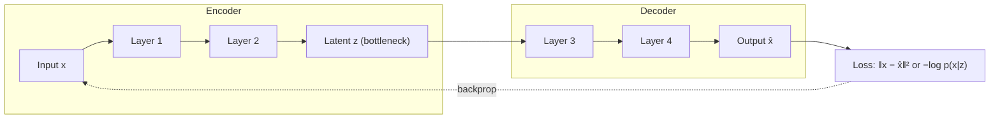

# Encoder-Decoder Architecture

**Compress, understand, reconstruct — the blueprint behind translation, summarization, and generative AI.**

You will learn what an encoder-decoder is, why the bottleneck matters, how to train one, and when to use each variant (autoencoder, VAE, Seq2Seq, Transformer) in production.

---

## What Is Encoder-Decoder Architecture?

An encoder-decoder model is a neural network split into two cooperating halves. The *encoder* takes raw input — a sentence, an image, a time series — and compresses it into a compact vector called the *latent code* or *bottleneck*. The *decoder* then takes that code and reconstructs the original input or generates a related output. Think of it like a game of telephone: the encoder "listens" to the full message and summarizes it into one sentence; the decoder "repeats" that sentence out loud, trying to preserve the meaning.

What makes this architecture powerful is the bottleneck. By forcing the entire input through a narrow information channel, the model must learn what is *essential*. Irrelevant noise gets discarded. This compression is not a bug — it is the feature. The model learns a latent representation that captures the underlying factors of the data, much like describing a movie plot in one paragraph instead of reciting every frame.

Encoder-decoder models come in many flavors. *Undercomplete autoencoders* use a narrow bottleneck for dimensionality reduction. *Variational autoencoders (VAEs)* add a probabilistic twist to the latent space so the model can *generate* new data by sampling random codes. *Sequence-to-sequence (Seq2Seq)* models handle variable-length inputs and outputs — the backbone of Google Translate and voice assistants. *Transformer encoder-decoders* (T5, BART) replace recurrence with self-attention and dominate modern NLP.



---

## Mathematical Formulation

| Concept | Equation | What it tells us |
|---------|----------|------------------|
| Undercomplete autoencoder | $\mathcal{L} = \|x - D(E(x))\|_2^2$ | Reconstruction error drives learning; latent must preserve enough info to rebuild input |
| Denoising autoencoder | $\mathcal{L} = \|x - D(E(\tilde{x}))\|_2^2,\ \tilde{x} \sim \mathcal{N}(x, \sigma^2 I)$ | Adding noise forces robust features; model must "fill in" corrupted parts |
| VAE evidence lower bound | $\mathcal{L} = \mathbb{E}_{q}[\log p(x|z)] - D_{\text{KL}}(q(z|x) \| p(z))$ | Two competing terms: reconstruct well vs. keep latent close to a Gaussian prior |
| Reparameterization trick | $z = \mu + \sigma \odot \epsilon,\ \epsilon \sim \mathcal{N}(0, I)$ | Makes sampling differentiable so gradients flow through encoder |
| Seq2Seq with attention | $c_t = \sum_i \alpha_{ti} h_i^{\text{enc}},\ \alpha_{ti} = \text{softmax}(\text{score}(h_{t-1}^{\text{dec}}, h_i^{\text{enc}}))$ | Decoder picks which encoder timesteps to focus on per output step |
| Cross-entropy (Seq2Seq) | $\mathcal{L} = -\frac{1}{T} \sum_t \log p(y_t^* \mid y_{<t}^*, X)$ | Maximize probability of correct next token given teacher-forced prefix |

---

## How It Works — Step by Step

**Step 1 — Encode (compress).** Input passes through the encoder (convolutional, recurrent, or transformer layers). Each layer abstracts the data further. The final encoder output becomes the latent code $z$.

*Analogy:* You read a Wikipedia article and summarize it into three bullet points. That is encoding.

**Step 2 — Bottleneck.** $z$ is a fixed-dimensional vector. In VAEs, the encoder outputs $\mu$ and $\sigma$ instead of a single vector, and $z$ is sampled from $\mathcal{N}(\mu, \sigma^2 I)$.

*Analogy:* Your three bullet points are all the decoder gets to see. If you wrote only one, key details are lost.

**Step 3 — Decode (reconstruct or generate).** The decoder transforms $z$ back to the original space (autoencoder) or generates a target sequence one token at a time (Seq2Seq).

*Analogy:* A friend reads your three bullet points and rewrites the full article. How close is it to the original?

**Step 4 — Compute loss and backpropagate.** Compare output to ground truth (MSE for AE, ELBO for VAE, cross-entropy for Seq2Seq). Gradients flow backward through decoder → bottleneck → encoder.

**Step 5 — Repeat.** Over epochs, the encoder gets better at compressing, the decoder at reconstructing. The latent code captures the truly important structure.

---

## Key Assumptions

| Assumption | If violated |
|------------|-------------|
| Bottleneck is small enough to force compression | Too large → model copies input (overfits). Too small → information loss, poor reconstruction. |
| Input and output share semantic structure (autoencoders) | Reconstruction loss becomes meaningless (e.g., reconstructing an image from audio embeddings). |
| Latent space is smooth and continuous (VAE) | Decoder sees gaps in latent space → unrealistic samples. VQ-VAE fixes this with discrete codes. |
| Encoder captures full source sequence (Seq2Seq) | Weak encoder → poor context vector. Attention fixes this by exposing all encoder hidden states. |
| Training and inference distributions match | Violated → exposure bias: model sees only correct prefixes during training but must handle its own errors at inference. |

---

## When to Use / When Not to Use

| Use Encoder-Decoder When ... | Avoid It When ... |
|------------------------------|-------------------|
| Input and output have different lengths (translation, summarization) | A simple classifier or regressor suffices |
| You need compressed features for downstream tasks | Data is very scarce (encoder-decoder needs more data than a single network) |
| You want to generate new data (images, text, molecules) | Latency is critical (two networks = twice the compute) |
| You handle variable-length sequences | Bottleneck is too narrow for the task (use attention or Transformer) |
| Anomaly detection (AE reconstructs normal data well, anomalies poorly) | Output modality differs fundamentally from input |

---

## Implementation Overview

| Aspect | From Scratch (NumPy) | Library (PyTorch / TensorFlow) |
|--------|----------------------|--------------------------------|
| Define encoder | Manual linear layers as matrix multiplies | `nn.Linear` / `nn.Conv2d` in a `nn.Module` |
| Define decoder | Same — manual matrix multiplies | `nn.Linear` / `nn.ConvTranspose2d` |
| Bottleneck | Explicit latent vector assignment | `nn.Linear(in, latent_dim)` |
| Loss (AE) | Manual MSE: `np.mean((x - x_hat)**2)` | `nn.MSELoss()` or custom VAE loss |
| Training loop | Manual forward + manual backward | `loss.backward()` + `optimizer.step()` |
| GPU support | Not available | `.to('cuda')` |

The simplest way to see an autoencoder in action uses a multi-layer perceptron as a bottleneck, even with sklearn:

```python
import numpy as np
from sklearn.neural_network import MLPRegressor

# 784 → 64 → 32 → 64 → 784: symmetric encoder-decoder
ae = MLPRegressor(hidden_layer_sizes=(64, 32, 64), activation='relu', max_iter=50, random_state=42)
ae.fit(X_train, X_train)          # input = target for reconstruction
X_reconstructed = ae.predict(X_test)
mse = np.mean((X_test - X_reconstructed) ** 2)
print(f"Reconstruction MSE: {mse:.4f}")
```

For real projects, use PyTorch/TensorFlow to get proper control over the latent code, attention mechanisms, and GPU training.

---

## Top 5 Interview Questions

**Q1. Explain the reparameterization trick in one sentence.**

- Sampling from $q(z|x)$ is non-differentiable → rewrite $z = \mu + \sigma \odot \epsilon$ with $\epsilon \sim \mathcal{N}(0, I)$ so gradients flow through $\mu$ and $\sigma$.

**Q2. What is posterior collapse in VAEs and how do you fix it?**

- Decoder ignores $z$ because it is too powerful; KL term vanishes to zero. Fixes: KL annealing (gradually increase $\beta$), $\beta$-VAE, free bits, or reducing decoder capacity.

**Q3. Compare teacher forcing with free-running inference in Seq2Seq.**

- Teacher forcing feeds ground-truth tokens → fast convergence but causes exposure bias. Free-running feeds own predictions → robust at inference but unstable early training. Solution: scheduled sampling (blend both).

**Q4. Your Seq2Seq model works on short sentences but fails on long ones. Why?**

- Fixed-length bottleneck cannot encode long sequences; gradients decay over many timesteps. Fix: add attention so decoder sees all encoder states, or switch to Transformer.

**Q5. What is the difference between an autoencoder and a variational autoencoder?**

- AE: deterministic bottleneck, no prior → cannot generate new samples. VAE: probabilistic bottleneck with KL regularizer → can sample from $p(z)$ and decode entirely new data.

---

## Quick Reference Table

| Item | Detail |
|------|--------|
| Algorithm Type | Unsupervised (AE, VAE) / Supervised (Seq2Seq) |
| Training Paradigm | Self-supervised reconstruction or conditional generation |
| Time Complexity (AE) | $O(L \cdot d_{\text{in}} d_{\text{out}})$ per layer, $L$ layers |
| Time Complexity (Seq2Seq RNN) | $O(T \cdot d^2)$ |
| Time Complexity (Transformer) | $O(T^2 \cdot d)$ |
| Space Complexity | $O(\text{num parameters})$ — dominated by encoder + decoder weights |
| Key Hyperparameters | Latent dim $d_z$, layer count, learning rate, KL weight $\beta$ |
| Evaluation Metrics | MSE/MAE (AE), BLEU/ROUGE (Seq2Seq), ELBO/FID/IS (VAE) |

---

## References & Further Reading

1. **Seq2Seq — original paper:** Sutskever, Vinyals & Le — *Sequence to Sequence Learning with Neural Networks* (NeurIPS 2014)
2. **VAE — original paper:** Kingma & Welling — *Auto-Encoding Variational Bayes* (ICLR 2014)
3. **Attention — original paper:** Bahdanau, Cho & Bengio — *Neural Machine Translation by Jointly Learning to Align and Translate* (ICLR 2015)
4. **Best tutorial:** Colah's blog — *Understanding LSTM Networks* and *Attention and Augmented Recurrent Neural Networks*
5. **PyTorch Seq2Seq tutorial:** [pytorch.org/tutorials/intermediate/seq2seq_translation_tutorial.html](https://pytorch.org/tutorials/intermediate/seq2seq_translation_tutorial.html)
