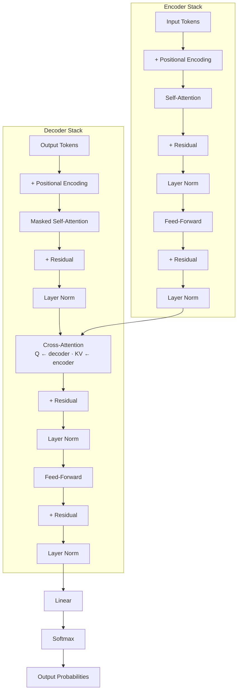

# Transformer Architecture

**Attention is all you need — and it replaces recurrence entirely.**

You will learn how the Transformer works, why self-attention replaced RNNs, how to train one, and when to use encoder-only (BERT), decoder-only (GPT), or encoder-decoder (T5) variants.

---

## What Is the Transformer?

The Transformer is a neural network architecture that processes sequences using **self-attention** instead of recurrence (RNNs) or convolution (CNNs). An RNN reads words one at a time — it cannot move to word 5 until it has finished word 4. A Transformer reads *all words at once* and uses pairwise attention scores to figure out which words matter to which. This makes it dramatically faster to train and better at capturing long-range dependencies.

Think of it like a committee of experts reading a report. Each expert (attention head) reads the entire document simultaneously, underlines different things (one focuses on people, another on dates, another on sentiment), and then they compare notes. If a sentence on page 1 mentions "she" and a sentence on page 10 clarifies "she = Dr. Smith," the committee can connect them instantly — no need to flip pages sequentially.

The original Transformer (Vaswani et al., 2017) has two stacks: an **encoder** that reads the input and builds a rich representation, and a **decoder** that generates output one token at a time while attending to the encoder's representation. Modern variants drop one stack: BERT uses only the encoder (for understanding), GPT uses only the decoder (for generation), and T5 keeps both (for translation/summarization).



**Note on normalization:** Unlike CNNs that use **batch normalization** (normalizes across the batch dimension), Transformers use **layer normalization** (normalizes across the feature dimension). This is because batch norm struggles with the variable-length sequences and small batch sizes common in NLP. Layer norm stabilizes training regardless of sequence length.

---

## Mathematical Formulation

| Concept | Equation | What it tells us |
|---------|----------|------------------|
| Scaled dot-product attention | $\text{Attention}(Q, K, V) = \text{softmax}\left(\frac{QK^T}{\sqrt{d_k}}\right)V$ | Each token's relevance to every other token is a softmax over scaled dot products; $\sqrt{d_k}$ prevents softmax saturation |
| Multi-head attention | $\text{MHA}(X) = \text{Concat}(\text{head}_1, \dots, \text{head}_h)W^O$ | Run $h$ attention operations in parallel; each head learns a different relationship type (syntax, semantics, position) |
| Positional encoding | $\text{PE}_{(pos,2i)} = \sin(pos / 10000^{2i/d}),\ \text{PE}_{(pos,2i+1)} = \cos(pos / 10000^{2i/d})$ | Sinusoidal waves at different frequencies let the model infer relative positions from the encoding pattern |
| Feed-forward network | $\text{FFN}(x) = W_2 \cdot \text{GELU}(W_1 x + b_1) + b_2$ | Each token passes through the same two-layer MLP independently; expands to $d_{ff}$ (usually $4 \times d_{\text{model}}$) then back |
| Pre-norm residual | $x_{l+1} = x_l + \text{Sublayer}(\text{LayerNorm}(x_l))$ | Norm before sublayer (pre-norm) enables stable training for 100+ layers; original post-norm was unstable at depth |

---

## How It Works — Step by Step

**Step 1 — Embed + encode position.** Each token is mapped to a $d_{\text{model}}$-dimensional vector. Sinusoidal positional encodings are *added* (not concatenated) so the model knows where each token sits.

*Analogy:* You give each word a sticky note with its position (1st, 2nd, 3rd…) so the model doesn't lose order.

**Step 2 — Self-attention (encoder).** Every token computes a query, a key, and a value. The attention score between token $i$ and token $j$ is $q_i \cdot k_j / \sqrt{d_k}$. Softmax converts scores to weights. The output for token $i$ is the weighted sum of all values.

*Analogy:* Each committee member asks "who is relevant to me?" (query), checks every other member's index card (key), and takes notes from the relevant ones (value).

**Step 3 — Multi-head concatenation.** The process above runs $h$ times with different projections. The $h$ outputs are concatenated and projected down to $d_{\text{model}}$.

*Analogy:* One head tracks nouns, another tracks verbs, a third tracks sentiment. They combine their findings into a unified representation.

**Step 4 — Feed-forward + residual.** Each token goes through a two-layer MLP. The residual connection adds the input back ($x + \text{Sublayer}(x)$) so gradients flow directly through the network.

*Analogy:* Each expert refines their notes independently, then compares the refined version with the original to avoid losing information.

**Step 5 — Masked self-attention (decoder).** Same as Step 2, except token $i$ can only attend to tokens $1, \dots, i$ (causal mask). Future tokens are hidden.

*Analogy:* When writing the next word, the decoder can only look at words already written — it cannot peek ahead.

**Step 6 — Cross-attention (decoder).** Queries come from the decoder, keys and values come from the encoder output. The decoder decides which parts of the input are relevant at each generation step.

*Analogy:* While writing the translation, the decoder keeps glancing back at the original sentence to check what comes next.

---

## Key Assumptions

| Assumption | If violated |
|------------|-------------|
| All pairwise interactions are useful | For very long sequences, full $O(n^2)$ attention wastes compute on irrelevant pairs → use sparse attention (Longformer, BigBird) |
| Position can be captured by additive encoding | Sinusoidal encoding extrapolates poorly beyond training lengths → use RoPE or ALiBi for relative position |
| Layer norm handles any sequence length | Batch norm fails here; but even layer norm can struggle with extreme length variance → bucket sequences by length |
| Pretraining data covers the target domain | Domain shift degrades performance dramatically → domain-adaptive pretraining (DAPT) is essential |
| Autoregressive generation is token-by-token | Causal masking assumes left-to-right; bidirectional tasks (like NER) need encoder-only (BERT) instead |

---

## When to Use / When Not to Use

| Use Transformer When ... | Avoid It When ... |
|--------------------------|-------------------|
| You need state-of-the-art NLP (translation, summarization, QA, chat) | Input is shorter than 5 tokens (a linear model + BoW often beats a Transformer at this scale) |
| You can access a pretrained model (BERT, GPT, T5) | Latency is extremely tight (< 10 ms) and memory is constrained (use DistilBERT or a tiny model) |
| You process variable-length sequences in parallel | Sequence length exceeds 4096 and you cannot use sparse attention |
| You work with multiple modalities (text + image + audio) | You have very little data (< 1k examples) and no pretrained checkpoint exists for your domain |
| Long-range dependencies matter (coreference, document-level reasoning) | A simple classifier or regression model suffices |

---

## Implementation Overview

| Aspect | From Scratch (NumPy) | Library (HuggingFace Transformers) |
|--------|----------------------|-------------------------------------|
| Define attention | Manual $Q, K, V$ projections + softmax + scaling | `AutoModel.from_pretrained('bert-base-uncased')` |
| Multi-head split | Manually reshape, transpose, concatenate | Built into `BertModel` / `GPT2Model` / `T5Model` |
| Positional encoding | Sinusoidal table or learned `nn.Embedding` | Handled automatically; configurable via `max_position_embeddings` |
| Training loop | Manual forward + backward (200+ lines) | `Trainer` API: 10 lines |
| GPU/TPU | Manual `.to(device)` + data parallelism | `TrainingArguments(strategy='tpu')` |

Sklearn does not implement the Transformer architecture natively. The standard training workflow uses the HuggingFace `Trainer`:

```python
from transformers import AutoTokenizer, AutoModelForSeq2SeqLM, Trainer, TrainingArguments

model = AutoModelForSeq2SeqLM.from_pretrained("t5-small")
tokenizer = AutoTokenizer.from_pretrained("t5-small")

training_args = TrainingArguments(
    output_dir="./results", num_train_epochs=3, per_device_train_batch_size=16,
    evaluation_strategy="epoch", save_strategy="epoch", logging_dir="./logs"
)
trainer = Trainer(model=model, args=training_args, train_dataset=train_dataset)
trainer.train()
```

---

## Top 5 Interview Questions

**Q1. Walk through a Transformer decoder layer forward pass. Where is the causal mask applied?**
- Three sublayers: masked self-attention, cross-attention, FFN. Causal mask goes into $QK^T$ before softmax (set future positions to $-\infty$). Pre-norm: LayerNorm before each sublayer, residual add after.

**Q2. Why do we scale attention by $\sqrt{d_k}$?**
- Dot products of random unit vectors have variance $d_k$; without scaling, large values push softmax into near-one-hot regions where gradients vanish. Scaling normalizes variance to ~1.

**Q3. Your Transformer overfits training data but has high validation loss. What do you check?**
- (a) Label smoothing too aggressive. (b) Dropout too low. (c) Model too large for data. (d) Exposure bias from teacher forcing. (e) Length distribution mismatch between train and validation.

**Q4. Compare sinusoidal PE, learned PE, and RoPE.**
- Sinusoidal: fixed, no params, poor extrapolation. Learned: flexible, no extrapolation. RoPE: relative via rotation matrices, good extrapolation, used in LLaMA. ALiBi: linear bias instead of additive encoding.

**Q5. How would you handle a 100k-token document with a Transformer?**
- Sparse attention (Longformer window + global), linear attention (Performer), or hierarchical (chunk + cross-attend). Each trades off memory vs expressivity.

---

## Quick Reference Table

| Item | Detail |
|------|--------|
| Algorithm Type | Supervised (Seq2Seq, classification) / Self-supervised (pretraining: MLM, CLM, denoising) |
| Training Paradigm | Pretrain (large corpus) → Fine-tune (task-specific) |
| Time Complexity | $O(n^2 \cdot d)$ for full attention; $O(n \cdot d)$ for linear/sparse variants |
| Space Complexity | $O(n^2)$ for attention matrix (bottleneck); $O(L \cdot d^2)$ for weights |
| Key Hyperparameters | $d_{\text{model}}$, number of heads $h$, layers $L$, $d_{ff}$, learning rate, warmup steps, dropout |
| Evaluation Metrics | Perplexity (LM), BLEU/ROUGE (generation), Accuracy/F1 (classification) |

---

## References & Further Reading

1. **Original paper:** Vaswani et al. — *Attention Is All You Need* (NeurIPS 2017)
2. **BERT paper:** Devlin et al. — *BERT: Pre-training of Deep Bidirectional Transformers for Language Understanding* (NAACL 2019)
3. **Best tutorial:** Jay Alammar — *The Illustrated Transformer* (jalammar.github.io)
4. **HuggingFace course:** *HuggingFace NLP Course* (huggingface.co/learn/nlp-course) — hands-on training with Transformers
5. **Kaggle notebook:** *Fine-Tuning BERT for Text Classification* on Kaggle — search "BERT text classification"
