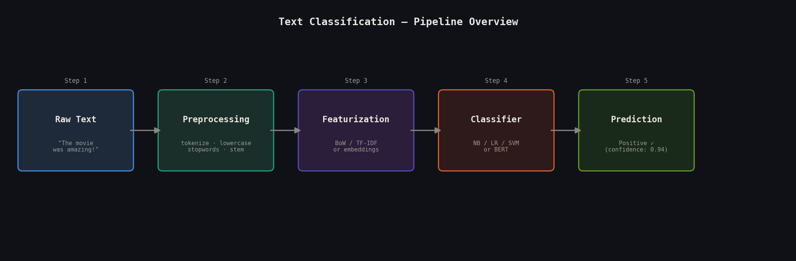

# Text Classification

> **Turning words into decisions — the gateway skill of modern NLP.**

After studying this topic you will be able to build, evaluate, and debug a complete text classification pipeline from raw strings to production predictions. You will understand when to reach for a 10-line Naive Bayes solution versus a fine-tuned transformer, and how to make that trade-off confidently in a system design interview.

---

## What Is Text Classification?

Text classification is the task of assigning one or more predefined labels to a piece of text. A spam filter reads your email and stamps it *spam* or *not spam*. A customer support system reads a ticket and routes it to *billing*, *technical*, or *returns*. A social media platform scans a comment and flags it *safe* or *harmful*. In every case, the machine is doing the same thing: reading words and making a decision.

Think of it like a postal sorting office. Each letter (document) arrives with no destination written on it. A trained sorter reads the address, recognizes patterns, and drops the letter into the correct bin. Text classification teaches a model to be that sorter — except instead of one sorter handling hundreds of letters, you have one model handling millions of documents per second.

The key insight is that classification is really a two-step problem: **representation** (how do we turn text into numbers?) and **decision** (given those numbers, which class?). Most of the historical progress in NLP has been about step one. Bag-of-words, TF-IDF, Word2Vec, and finally transformer embeddings are all different answers to the same question: *what is the best number-version of this sentence?* Once you have a good representation, even a simple logistic regression can be surprisingly powerful.

---

## Mathematical Formulation

### Naive Bayes Decision Rule

$$\hat{y} = \arg\max_{c} \left[ \log P(c) + \sum_{i=1}^{n} \log P(x_i \mid c) \right]$$

**What it tells us:** Pick the class `c` that maximizes the sum of the log prior probability of that class and the log likelihood of each word appearing in that class. The log transform converts the product of small probabilities (which causes numerical underflow) into a safe sum. The prior `P(c)` encodes how common each class is before seeing any words; the likelihood terms `P(xᵢ | c)` encode how diagnostic each word is.

### TF-IDF Weight

$$\text{TF-IDF}(t, d) = \underbrace{\frac{f_{t,d}}{\sum_{t'} f_{t',d}}}_{\text{term frequency}} \times \underbrace{\log\!\left(\frac{N}{df_t}\right)}_{\text{inverse doc frequency}}$$

**What it tells us:** A word's importance in a document scales with how often it appears *in that document* (TF) but is discounted by how often it appears *across all documents* (IDF). The word "the" appears everywhere, so IDF crushes its weight to near zero. The word "photosynthesis" in a biology article is rare globally, so IDF amplifies its weight — correctly signaling that it is informative.

### Softmax + Cross-Entropy Loss

$$P(y = c \mid \mathbf{x}) = \frac{\exp(\mathbf{w}_c^\top \mathbf{x})}{\sum_{k} \exp(\mathbf{w}_k^\top \mathbf{x})}, \qquad \mathcal{L} = -\sum_{c} y_c \log \hat{y}_c$$

**What it tells us:** Softmax squashes raw scores (logits) into a valid probability distribution that sums to 1. Cross-entropy then penalizes the model in proportion to how surprised it was by the correct label. A confident wrong prediction is penalized heavily; a confident correct prediction contributes near-zero loss. This combination is the natural objective for any classification task derived from maximum likelihood estimation.

### Laplace (Add-α) Smoothing

$$P(w \mid c) = \frac{\text{count}(w, c) + \alpha}{\sum_{w'} \text{count}(w', c) + \alpha \lvert V \rvert}$$

**What it tells us:** Without smoothing, a word never seen in class `c` during training gets `P(w | c) = 0`, which zeroes out the entire product regardless of every other word. Adding `α` (typically 1) to every word count ensures no probability is ever exactly zero — a small but critical fix.

---

## How It Works — Step by Step

**Step 1 — Collect and label data.**
Every supervised classifier needs examples. For sentiment analysis, this might be 10,000 movie reviews with human-assigned *positive* / *negative* labels. Quality matters more than quantity: 1,000 clean labels beat 10,000 noisy ones.

**Step 2 — Preprocess the text.**
Raw text is messy. You lowercase everything ("Movie" and "movie" are the same word), strip punctuation, remove stopwords ("the", "and", "is"), and optionally stem words ("running" → "run"). *Important caveat:* when fine-tuning BERT, skip most of this — the tokenizer handles it and stripping context hurts performance.

**Step 3 — Convert text to features.**
A model cannot read strings; it needs vectors. The classic approach: build a vocabulary of all unique words in the training corpus, then represent each document as a vector of TF-IDF weights — one dimension per vocabulary word. A 10,000-word vocabulary means a 10,000-dimensional sparse vector. Modern approaches replace this with dense 768-dimensional embeddings from a pretrained transformer.

**Step 4 — Train the classifier.**
Feed your feature vectors and labels to a learning algorithm. For Naive Bayes, this means counting word frequencies per class. For logistic regression, it means gradient descent on the cross-entropy loss. For BERT fine-tuning, it means backpropagating through the entire transformer with a small learning rate (~2e-5).

**Step 5 — Evaluate rigorously.**
Accuracy alone lies on imbalanced datasets. Always compute precision, recall, and F1 per class. For binary classification, plot the precision-recall curve and choose your decision threshold based on the cost of false positives vs. false negatives in your specific application.

**Step 6 — Predict on new text.**
At inference time, run the same preprocessing and featurization pipeline on unseen text, pass it through the trained model, and return the class with the highest probability (or all classes above a threshold, for multi-label tasks).

---

## Pipeline Overview

*The five-stage journey from raw text to a predicted label.*




> **Figure 1.** Raw text flows through preprocessing, featurization, and a classifier to produce a predicted class and confidence score. The featurization stage is where classical (TF-IDF) and modern (transformer embeddings) approaches diverge most sharply.

---

## Key Assumptions

| Assumption | What Happens If Violated |
|---|---|
| **Naive Bayes: words are conditionally independent given class** | Co-occurring words (e.g., "not good") are treated as independent signals. "Not" and "good" each vote separately, potentially canceling out the negation. Performance degrades on sentiment tasks with nuanced language. |
| **Training and serving data come from the same distribution** | Model accuracy degrades silently in production. A spam filter trained on 2020 emails fails on 2024 phishing patterns. Monitor feature drift and retrain periodically. |
| **Labels are correct** | Label noise introduces a soft ceiling on accuracy. Discriminative models (LR, BERT) overfit noisy labels faster than generative Naive Bayes. Use label smoothing or confident-learning techniques to mitigate. |
| **Vocabulary at inference overlaps training vocabulary** | OOV (out-of-vocabulary) words map to UNK or zero vectors, silently losing signal. Subword tokenization (BPE, WordPiece) makes this a non-issue for transformer-based models. |
| **Classes are mutually exclusive (multi-class)** | Softmax forces probabilities to sum to 1, making multi-label classification structurally wrong. Use sigmoid + binary cross-entropy per label instead. |

---

## When to Use / When Not to Use

| ✅ Use Text Classification When | ❌ Avoid When |
|---|---|
| You have a fixed, predefined set of categories | The task requires open-ended generation (use LLM) |
| Labels are available or can be collected cheaply | The structure between labels matters (use seq2seq or NER) |
| Low-latency inference is required (<10ms) | The problem is better framed as retrieval or ranking |
| The classification boundary is relatively stable | Labels shift constantly — model decay will be rapid |
| Interpretability is needed (use LR + TF-IDF) | You have zero labeled data and semantic search suffices |
| >500 labeled examples exist | Fewer than ~50 labels — zero-shot LLM prompting is faster |

---

## Implementation Overview

### Conceptual Comparison: From Scratch vs. Scikit-learn

| Aspect | From Scratch (NumPy) | Scikit-learn / HuggingFace |
|---|---|---|
| **Vocabulary** | Build a word-to-index dict manually | `TfidfVectorizer` handles this |
| **Smoothing** | Manually add α to every count | `MultinomialNB(alpha=1.0)` |
| **Fitting** | Loop over documents, accumulate counts | `.fit(X_train, y_train)` |
| **Inference** | Compute log-posterior per class, argmax | `.predict(X_test)` |
| **Featurization** | Manual TF-IDF or count matrix | `Pipeline([vectorizer, clf])` |
| **BERT fine-tune** | Full training loop with optimizer, scheduler | `Trainer` API, ~50 lines |
| **Best for** | Learning the math, interviews | Production, iteration speed |

### Sklearn Pipeline — Full Training Example

```python
from sklearn.pipeline import Pipeline
from sklearn.feature_extraction.text import TfidfVectorizer
from sklearn.linear_model import LogisticRegression
from sklearn.model_selection import train_test_split
from sklearn.metrics import classification_report

# Example data (replace with your corpus)
texts  = ["I loved this movie", "Terrible waste of time",
          "Absolutely brilliant", "Worst film ever made",
          "Great acting and story", "Boring and predictable"]
labels = ["positive", "negative", "positive",
          "negative", "positive", "negative"]

X_train, X_test, y_train, y_test = train_test_split(
    texts, labels, test_size=0.33, random_state=42
)

# Build pipeline: vectorizer is fit ONLY on training data (no leakage)
pipeline = Pipeline([
    ("tfidf", TfidfVectorizer(ngram_range=(1, 2), max_features=50_000)),
    ("clf",   LogisticRegression(C=1.0, max_iter=1000, class_weight="balanced")),
])

pipeline.fit(X_train, y_train)
y_pred = pipeline.predict(X_test)

print(classification_report(y_test, y_pred))

# Inference on new text
print(pipeline.predict(["This film was a masterpiece"]))
# → ['positive']
```

> **Key detail:** The `Pipeline` object ensures `TfidfVectorizer` is fitted only on `X_train`. Fitting on the full corpus — including test data — is one of the most common evaluation bugs in NLP.

---

## Top 5 Interview Questions

**Q1. Design a system to classify support tickets into 50+ categories with 90%+ accuracy.**

- Start with the data strategy: how many labels per class? Is labeling feasible?
- Choose baseline: TF-IDF + LR → BERT fine-tune, justify the jump
- Address class imbalance: `class_weight='balanced'`, oversampling, threshold per class
- Discuss evaluation: macro-F1 is more honest than accuracy here
- Production concerns: latency (distilled model?), retraining cadence, label drift monitoring

**Q2. Why does Naive Bayes work so well despite the independence assumption being obviously wrong?**

- The decision boundary only requires the *ranking* of class probabilities to be correct, not calibrated probabilities
- Even miscalibrated likelihoods often produce correct argmax decisions
- Breaks down when strong word correlations exist ("not good") and nuance is critical
- Works especially well with small data because it has very few parameters to overfit

**Q3. Your model gets 95% accuracy in eval but decays after 3 months in production. Debug it.**

- Check for training/serving skew: are the preprocessing pipelines identical?
- Investigate concept drift: have the topics or language in production changed?
- Look at label drift: did the *definition* of classes shift (new product lines, policy changes)?
- Monitor feature distribution: compare mean TF-IDF vectors over time
- Solution: sliding-window retraining, uncertainty-triggered human review queues

**Q4. You have 500 labeled examples. Do you fine-tune a small model, few-shot a large LLM, or zero-shot?**

- Zero-shot first: establish a free baseline with an NLI-based model or GPT
- Few-shot prompting: if zero-shot is within 10% of target, iterate on prompts — no infra cost
- Fine-tuning: if you need <100ms latency or the task is domain-specific, fine-tune DistilBERT
- Cost axis: few-shot API calls at $0.01/query become expensive at 10M queries/day
- 500 labels with BERT fine-tuning typically beats few-shot if the domain is narrow

**Q5. False negatives cost 10× more than false positives. How do you encode this?**

- Training: set `class_weight={positive: 10, negative: 1}` to scale the loss
- Evaluation: report expected cost = 10×FN + 1×FP rather than F1
- Threshold tuning: lower decision threshold from 0.5 → find optimal point on PR curve
- Never optimize for accuracy or even standard F1 — define a cost-weighted F-beta score (β = √10 here)
- Communicate to stakeholders: "We accept more false alarms to catch more real harm"

---

## Quick Reference Table

| Item | Detail |
|---|---|
| **Algorithm type** | Supervised, discriminative or generative, classification |
| **Naive Bayes time complexity** | O(N·V) training, O(V) inference (N = docs, V = vocab size) |
| **Logistic Regression (sparse)** | O(N·V·iterations) training, O(V) inference |
| **BERT fine-tuning** | O(N·L·seq²) training (L = layers, seq = sequence length) |
| **Space complexity** | O(C·V) for NB; O(V) for LR; O(110M params) for BERT-base |
| **Key hyperparameters** | `alpha` (NB smoothing), `C` (LR regularization), `max_features` (vocab), `learning_rate` + `num_epochs` (transformers) |
| **Primary evaluation metrics** | Macro-F1, per-class precision/recall, AUC-ROC, confusion matrix |
| **When to use accuracy** | Only when classes are perfectly balanced |
| **Baseline to always beat** | Majority-class classifier, random classifier |
| **Production gotcha** | Fit vectorizer on train only; same preprocessing at serving time |

---

## References & Further Reading

| Resource | Why Read It |
|---|---|
| [Naive Bayes and Text Classification — Raschka (2014)](https://arxiv.org/abs/1410.5329) | Clearest mathematical walkthrough of the generative model; ideal complement to implementation |
| [fastText: Bag of Tricks for Efficient Text Classification — Joulin et al. (2016)](https://arxiv.org/abs/1607.01759) | Understand how character n-grams and hierarchical softmax achieve near-BERT accuracy at 1000× the speed |
| [Fine-Tuning BERT for Text Classification — Sun et al. (2019)](https://arxiv.org/abs/1905.05583) | Systematic study of fine-tuning strategies; answers "how many epochs, which layers to freeze" empirically |
| [HuggingFace Text Classification Tutorial](https://huggingface.co/docs/transformers/tasks/sequence_classification) | Best hands-on guide to the Trainer API; covers multi-label, custom datasets, evaluation |
| [Kaggle: NLP Getting Started (Disaster Tweets)](https://www.kaggle.com/c/nlp-getting-started) | Ideal first competition: real imbalanced data, leaderboard feedback, hundreds of public notebooks spanning NB to BERT |

---

*Maintained as part of the MIT ML Study Series. Contributions welcome via pull request.*


