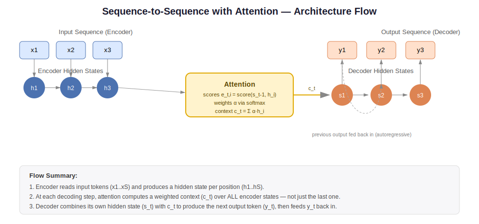
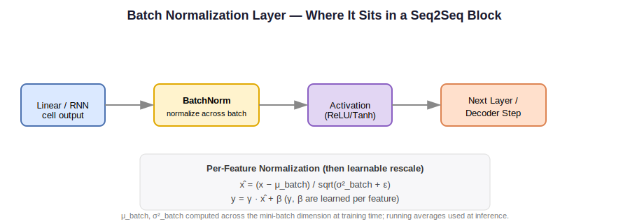

# Sequence-to-Sequence (Seq2Seq) Models

**Tagline:** Teaching machines to turn one sequence into another — translation, summarization, and conversation, all under one architecture.

**What you will learn:** You'll understand how an encoder-decoder architecture maps a variable-length input sequence to a variable-length output sequence, and why attention was introduced to fix the information bottleneck of early seq2seq designs. You'll also learn the core math, decoding strategies, common failure modes, and how to implement and evaluate a seq2seq system.

---

## 2. What is a Sequence-to-Sequence Model?

A Sequence-to-Sequence model is a neural network design built to take in one sequence (like a sentence in English) and produce a different sequence as output (like the same sentence translated into French). What makes this hard is that the input and output don't have to be the same length — "How are you?" (3 words) might translate to "Comment vas-tu?" (3 words in French, but it could just as easily be longer or shorter for other language pairs). Traditional neural networks expect fixed-size inputs and outputs; seq2seq models are specifically engineered to handle this variable-length, variable-length mapping.

The architecture has two halves: an **encoder** that reads and compresses the entire input sequence into a numerical representation, and a **decoder** that generates the output sequence one piece at a time, using that representation as a starting point. A useful analogy is a simultaneous interpreter at the United Nations. The interpreter listens to an entire sentence in one language (encoding — building up an internal understanding), and then begins speaking in the target language (decoding), generating one word at a time, constantly referring back to what they heard and what they've already said so far. Early seq2seq models tried to compress the *entire* input into a single fixed-size "summary" before starting to decode — like asking the interpreter to listen to the whole sentence, write down one short note, put away the audio, and then translate purely from that note. This works for short sentences but breaks down for long ones, because that single note simply can't hold everything.

This is exactly the problem that **attention** was invented to solve. Instead of relying on one fixed summary, attention lets the decoder "look back" at every part of the original input at every step of generation, deciding which parts matter most right now. Going back to our interpreter: with attention, it's as if the interpreter keeps the full transcript in front of them and can glance back at any word at any time while speaking — far more robust for long or complex sentences. This single idea — letting a model dynamically refer back to relevant parts of its input — turned out to be so powerful that it became the foundation of the Transformer architecture, which now powers most modern large language models.

---

## 3. Mathematical Formulation

**Core generative factorization (what the decoder is actually computing):**

```
P(y1​,…,yT​∣x1​,…,xS​)=t=1∏T​P(yt​∣y<t​,x1:S​)
```

*Significance:* The output sequence isn't generated all at once — each token is predicted conditioned on everything generated so far AND the full input. This is what makes generation **autoregressive**: every decision depends on prior decisions.

**Attention alignment score:**

$$
e_{t,i} = \text{score}(s_{t-1}, h_i)
$$

*Significance:* At decoding step `t`, the model scores how relevant each encoder position `i` is, given where the decoder currently is (`s_{t-1}`). This is the mechanism that replaces "one fixed summary" with "look at everything, weighted by relevance."

**Attention weights (normalized):**

$$
\alpha_{t,i} = \frac{\exp(e_{t,i})}{\sum_j \exp(e_{t,j})}
$$

*Significance:* Converts raw scores into a probability distribution over input positions — these weights sum to 1 and tell you exactly how much "focus" each input token gets at this decoding step.

**Context vector:**

$$
c_t = \sum_i \alpha_{t,i} \cdot h_i
$$

*Significance:* This is the dynamically computed "relevant summary" for this specific decoding step — a weighted blend of all encoder states, rather than a single static vector.

**Scaled dot-product attention (Transformer form):**

$$
\text{Attention}(Q, K, V) = \text{softmax}\left(\frac{QK^T}{\sqrt{d_k}}\right) V
$$

*Significance:* This generalizes the same idea into matrix form so it can be computed for every position in parallel — Query/Key/Value matrices replace the step-by-step recurrence, which is exactly what makes Transformers fast to train.

**Training loss (cross-entropy):**

$$
\mathcal{L} = -\sum_{t} \log P(y_t \mid y_{<t}, x)
$$

*Significance:* The model is penalized based on how much probability it assigned to the *correct* next token at every step — standard maximum-likelihood training for sequence generation.

---

## 4. How It Works — Step by Step

1. **Tokenize and embed the input sequence.** "How are you?" → numerical token IDs → dense embedding vectors. Think of this as converting handwritten notes into a typed format the model can process.
2. **Encode the input.** The encoder (RNN, LSTM, or Transformer encoder) processes the embeddings and produces a hidden state for *every* input position — like the interpreter building understanding word by word, but keeping notes on each word, not just a final summary.
3. **Initialize the decoder.** The decoder starts generating output, usually beginning with a special `<START>` token — like the interpreter taking a breath before speaking.
4. **Compute attention at each decoding step.** Before producing each output word, the decoder scores all encoder hidden states for relevance and builds a context vector — the interpreter glancing back at the relevant part of the transcript.
5. **Generate the next output token.** The decoder combines its own current state with the attention context to predict a probability distribution over the vocabulary, and picks (or samples) the next token — "Comment" is chosen as the first French word.
6. **Feed the generated token back in (autoregressive loop).** The just-generated word becomes part of the input for generating the next word — like the interpreter remembering what they just said so the next words flow grammatically.
7. **Repeat until an end token is generated or a max length is reached.** The output sequence "Comment vas-tu?" is complete once the model generates an `<END>` token.
8. **(Training only) Use teacher forcing.** Instead of feeding the decoder its own (possibly wrong) prediction at training time, the *true* previous word is fed in — like a teacher prompting the interpreter with the correct previous phrase so early mistakes don't snowball during practice.

---

## 5. Key Assumptions

| Assumption | If Violated |
|---|---|
| Sufficient parallel training data (input-output pairs) exists | Model underfits or produces generic/degenerate outputs; quality scales heavily with data size |
| Output tokens are conditionally dependent mainly on recent context + input | Long-range dependencies get lost, causing incoherent or contradictory long outputs |
| Teacher forcing during training approximates real inference conditions | Exposure bias — model is fragile to its own mistakes once it has to rely on its own generated tokens |
| Vocabulary covers most relevant tokens (with subword fallback for rare ones) | Out-of-vocabulary words get mishandled, producing `<UNK>` tokens or garbled output |
| Greedy/beam decoding approximates the true highest-probability sequence well | Search errors can produce degenerate, repetitive, or overly generic ("safe") outputs |
| Input and output share enough structural/semantic correlation for the task | Garbage-in-garbage-out — e.g., trying to "translate" between unrelated domains gives meaningless results |

---

## 6. When to Use / When Not to Use

| ✅ Use Seq2Seq When... | ❌ Avoid / Reconsider When... |
|---|---|
| The task genuinely requires variable-length input → variable-length output (translation, summarization, dialogue) | Output is a fixed-size label or fixed-size structure (classification, regression) — a simpler model suffices |
| You have (or can obtain) a reasonably large parallel corpus of input-output pairs | Training data is extremely scarce — consider few-shot prompting with a pretrained LLM instead |
| Latency budget allows for autoregressive, token-by-token generation | Ultra-low-latency requirements where non-autoregressive or retrieval-based methods are necessary |
| The relationship between input and output benefits from attending back to specific input parts (e.g., copying names/numbers) | The task is purely extractive (e.g., span selection) — a tagging/extraction model is more efficient and accurate |
| You can leverage a pretrained seq2seq backbone (T5, BART) for fine-tuning | You need strict factual guarantees with zero hallucination tolerance without additional grounding/verification |

---

## 7. Implementation Overview

> **Note:** `sklearn` does not provide a sequence-to-sequence implementation (it's a deep-learning architecture, outside sklearn's scope). The conceptual "library" counterpart here is a deep learning framework's pretrained seq2seq stack (HuggingFace `transformers`), shown below in place of sklearn given the topic's nature.

| Aspect | From Scratch (NumPy / manual PyTorch) | Library (HuggingFace `transformers`) |
|---|---|---|
| Encoder/decoder cells | Manually implemented RNN/LSTM recurrence and hidden-state passing | Pretrained Transformer encoder-decoder (e.g., T5, BART) loaded in one line |
| Attention | Manually computed alignment scores, softmax, and context vector aggregation | Built-in multi-head cross-attention layers, fully optimized and parallelized |
| Training loop | Manual teacher-forcing loop, manual loss computation and backprop | `Seq2SeqTrainer` handles batching, teacher forcing, checkpointing, and logging |
| Decoding | Manually implemented greedy or beam search | `.generate()` with built-in beam search, sampling, and length penalties |
| Best for | Deep understanding of mechanics, exam/interview prep | Production-quality results fast, minimal boilerplate, access to pretrained weights |

```python
# "Library" example: fine-tuning a pretrained seq2seq model (conceptual fit/predict pattern)
from transformers import AutoTokenizer, AutoModelForSeq2SeqLM, Seq2SeqTrainer, Seq2SeqTrainingArguments

model_name = "t5-small"
tokenizer = AutoTokenizer.from_pretrained(model_name)
model = AutoModelForSeq2SeqLM.from_pretrained(model_name)

# Assume train_dataset/eval_dataset are pre-tokenized Hugging Face Datasets
training_args = Seq2SeqTrainingArguments(
    output_dir="./seq2seq-out",
    per_device_train_batch_size=8,
    num_train_epochs=3,
    predict_with_generate=True   # enables proper autoregressive decoding during evaluation
)

trainer = Seq2SeqTrainer(
    model=model,
    args=training_args,
    train_dataset=train_dataset,
    eval_dataset=eval_dataset,
    tokenizer=tokenizer
)

trainer.train()                              # equivalent of .fit()
predictions = trainer.predict(eval_dataset)  # equivalent of .predict()
```

---

## 8. Top 5 Interview Questions

1. **Why does a vanilla encoder-decoder RNN struggle with long sequences, and how does attention fix it?**
   - Mention fixed-size context vector bottleneck, dynamic per-step weighting via attention.
2. **Explain teacher forcing — why use it, and what problem does it cause at inference?**
   - Cover exposure bias, error accumulation, mitigation via scheduled sampling.
3. **Greedy decoding vs. beam search vs. sampling — when would you choose each in production?**
   - Discuss latency vs. quality vs. diversity trade-offs, length normalization in beam search.
4. **How does Transformer attention differ from Bahdanau/Luong attention in RNN seq2seq?**
   - Self-attention vs. cross-attention, parallelization, scaled dot-product vs. additive scoring.
5. **A summarization model keeps hallucinating facts — how do you diagnose and fix it?**
   - Bring up copy mechanisms, faithfulness metrics, training data audits, decoding constraints.

---

## 9. Quick Reference Table

| Item | Detail |
|---|---|
| Algorithm Type | Conditional sequence generation (encoder-decoder, autoregressive) |
| Time Complexity | O(S+T) per sequence for RNN-based; O(S²+T²) for Transformer self/cross-attention (S, T = input/output lengths) |
| Space Complexity | O(S·T) for attention weight matrices per layer |
| Key Hyperparameters | Hidden/embedding size, number of layers/heads, learning rate, beam width, teacher-forcing ratio |
| Evaluation Metrics | BLEU, ROUGE, perplexity, (increasingly) human/LLM-judged faithfulness scores |

---

## 10. References & Further Reading

- Sutskever, Vinyals, Le (2014) — *Sequence to Sequence Learning with Neural Networks* (the original seq2seq paper)
- Bahdanau, Cho, Bengio (2015) — *Neural Machine Translation by Jointly Learning to Align and Translate* (introduces attention)
- Vaswani et al. (2017) — *Attention Is All You Need* (the Transformer paper)
- HuggingFace `Seq2SeqTrainer` documentation — practical fine-tuning guide for T5/BART
- Kaggle: "Neural Machine Translation with Attention" notebooks — hands-on encoder-decoder + attention walkthroughs

---

### Architecture Diagrams

**Encoder-Decoder with Attention — Flow Diagram**


**Batch Normalization Layer (within a seq2seq block)**


*Both diagrams above were custom-generated (SVG) for this README and are included in this folder.*
